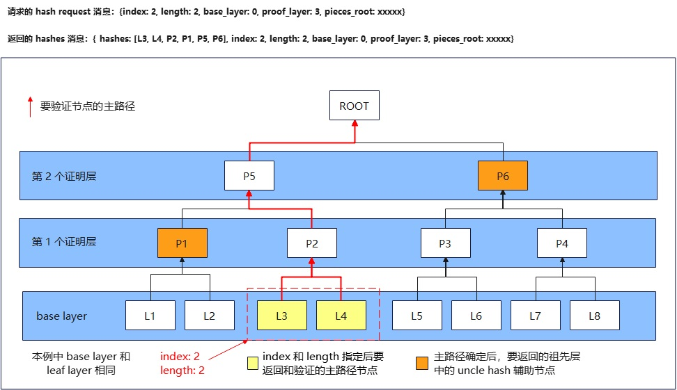

# <center>BitTorrent Protocol 规范 v2</center>

BitTorrent 是一个用于文件分发的协议，它通过 URL 来标识内容，并被设计成与 web 无缝集成。
它的相对于一般 HTTP 的优势在于，当相同的文件有多个下载并发进行时，下载者之间可互传数据，这使得文件源在仅增加少量负载的情况下就能支持数量众多的下载成为可能。

## 一个 BitTorrent 文件分发由以下实体组成：
- 一个普通的 web 服务器
    > *译注：存放 .torrent 种子文件的 web 服务器，比如可以下载附件的论坛等等*
- 一个静态的 'metainfo' 文件
    > *译注：这是以 .torrent 为扩展名的种子文件，它相当于是被下载资源文件的一个概述*
- 一个 BitTorrent tracker 服务器
    > *译注：让下载同一个文件的多个下载器之间能互相认识的一个服务器*
- 一个 '下载源' ('original' downloader)
    > *译注：拥有被下载资源文件 100% 内容，并将其提供给别人下载的下载器，俗称 '做种者'*
- 终端用户 web 浏览器
    > *译注：终端用户通过 web 浏览器，在 web 服务器上下载到 .torrent 种子文件*
- 终端用户下载器(downloader)
    > *译注：终端用户通过下载器 (downloader)，下载 .torrent 种子文件对应的资源文件*

理想情况下，一个单独的文件有多个终端用户在下载。

## 要提供 Bittorent 下载服务，主机端需要执行以下步骤：

1. 启动运行一个 tracker 服务器(或者，更可能的是有一个已经运行的 tracker)。
2. 启动运行一个普通的 web 服务器，比如 apache ，或者有一个已经运行的。
3. 在该 web 服务器上将 `.torrent` 扩展名和 `mimetype applicaton/x-bittorrent` 进行关联（或者已经完成此操作）。
4. 使用要发布的完整文件和 tracker 服务器的 url，生成一个 `metainfo` (`.torrent`) 文件。
5. 将 `metainfo` 文件放到 web 服务器上。
6. 将 `metainfo` (`.torrent`) 文件的链接放入某个 web 页面中。
7. 启动一个已经有了完整文件的 downloader (the 'origin')

> *译注：*
> 总结一下，提供 BitTorrent 文件下载服务，需要如下步骤：
>
> 1. 启动 Tracker 服务。
> 2. `.torrent` 文件的生成和发布：这包括根据要发布的文件本身的内容和 Tracker 服务器的 URL 生成 `metainfo` 文件，即 `.torrent` 文件，
> tracker 服务器地址被写入 .torrent 文件中；将 `.torrent` 文件发布到 Web 服务器上，提供对该 `.torrent` 文件的下载服务；将 `.torrent` 文件的链接尽可能的传播出去。
> 3. 启动提供文件的下载源。
>
> 真正用于实际的文件下载的组件是 Tracker 服务器，和文件的下载源节点。

## 要启动下载，用户需要执行以下步骤：

1. 安装 BitTorrent (或已经安装完成该操作)。
2. 浏览 web 。
3. 点击 `.torrent` 文件的链接。
4. 选择保存资源文件的本地路径，或者选择一个部分下载的资源文件并恢复下载。
5. 等待下载完成。。
6. 退出下载器 (它会持续上传数据直到退出)

> *译注：* 总结一下，BitTorrent 文件下载有两个过程：
一是下载 `.torrent` 文件；二是使用 BitTorrent 客户端下载文件，数据的来源将是网络中包含文件数据的其它节点。

## Bencode 编码

- 字符串(string)表示为：十进制的长度前缀，后接冒号和字符串本身。
    *例如：`spam` 的编码为 `4:spam`*
- 整数(integer)表示为：`i`开头，后接十进制的数字，然后跟一个 `e` 表示结束。
    *例如：`3` 的编码为 `i3e`；`-3` 的编码为 `i-3e`*
    整数没有大小限制，`i-0e` 是无效的。除了表示 0 的 `i0e` 以外，所有以 0 为开头的编码，比如：`i03e`，都是无效的。
- 列表(list)表示为：`l` 开头，后接列表元素（这些元素也是 B 编码的），然后用 `e` 表示结束。
     *例如：`['spam', 'eggs']` 的编码为 `l4:spam4:eggse`*
- 字典(dictionary)表示为：`d`开头，后面交替跟着 `key` 及其对应的 `value` ，然后用 `e` 表示结束。
    *例如： `{'cow': 'moo', 'spam': 'eggs'}` 的编码为 `d3:cow3:moo4:spam4:eggse`; `{'spam': ['a', 'b']}` 的编码为 `d4:spaml1:a1:bee`*
   **Key 必须为字符串并且顺序排列（按照原始字符（raw string）串排序，而不是字母顺序）**

> *译注：*
>
> `BitTorrent` 协议发明了一种编码方式，即 `Bencode` , `Bencode` 编码有 4 种数据类型，即字符串，整数，列表，和字典（即映射）。
基本数据类型是字符串和数字，列表和字典则是两种最常用的容器类型。
>
> `raw string` 排序: 
按照二进制编码的大小排序，比如 '10' 和 '2' 两个字符串从小到大排序，'10' 排在 '2' 前面，因为 '1' 的 二进制编码小于 '2' 的二进制编码。

请注意，在 bencoding 的上下文中，包括字典的 key 在内的字符串是任意的字节序列（uint8_t[], 就是二进制字节，即使它不存在对应的 ascii 或 unicode）。

BEP 的作者建议使用与 ASCII 兼容的字符串作为字典键，并使用 UTF-8 编码人类可读的数据。不过，具体实现不能依赖于此规定。

## metainfo 文件

Metainfo 文件（也就是以 `.torrent` 为扩展名的文件）被编码为 bencode 字典，具有以下 key：

### announce

表示 tracker 的 URL 。

### info

它的值是一个字典，接下来会描述该字典中的 key 。

### piece layers

它是一个字符串字典。它的 key 是每个文件的 merkle root hash 值；它的 value 由该默克尔树中某一层(layer)内的所有 hash 值的连接组成。
对于 `file tree` 项中每个大于 `piece length` 的文件，在 `piece layers` 中都会包含该文件对应的 key 和 value; 小于 `piece length` 的文件不计入 `piece layers` 中。
选择的 layer（层）是为了确保 `piece layers` 中的一个哈希值能够覆盖 `piece length` 的字节。
例如，如果`piece` 大小为 16KiB，则使用叶子的哈希值。如果使用的 `piece` 大小为 128KiB，则使用从叶子哈希值起算的第三层。
仅覆盖文件末尾之外的数据（即仅用于平衡树）的 `layer hashes` 被省略。
所有哈希值都以其二进制格式存储。

如果此字段缺失、所含哈希值与 merkle 根不匹配或不是来自正确的 layer，则该 torrent 无效。

此 BEP 定义的 .torrent 文件中包含人类可读文本的所有字符串均采用 UTF-8 编码。

一个 Torrent 创建示例程序可以在 [这里](http://bittorrent.org/beps/bep_0052_torrent_creator.py) 找到

> **译注** 这里需要说明的地方有点多，原文写的比较含糊
> --
> - 什么是 `Merkle` 树？什么是 `Hash` 覆盖？ : 
>
>   `Merkle tree` 是一种特殊的二叉树，它的每个节点都存储了一个数据块的哈希值。对于叶子节点，它们存储的是数据块本身的哈希值；
> 而对于非叶子节点，它们存储的是其子节点哈希值组合的哈希值。这样，当所有数据块的哈希值都被计算并组合后，最终会得到一个根节点的哈希值，这个值就是默克尔根。
> 
>   举个例子来说，假设有一个 torrent 文件，它包含了 4 个数据块 `A`、`B`、`C`、`D`。首先，对每个数据块计算哈希值，得到 `H(A)`、`H(B)`、`H(C)`、`H(D)`。
> 然后，将这些哈希值两两组合并再次计算哈希值，得到两个中间节点的哈希值 `HG_1 = H(H(A) + H(B))` 和  `HG_2 = H(H(C) + H(D))`。
> 最后，这两个中间节点的哈希值再次组合并计算哈希值 `H_ROOT = H(HG_1 + HG_2)`，得到的 `H_ROOT` 就是默克尔根。
> 其中 `HG_1` 我们可以说它覆盖了数据块 `A` 和 `B`，`HG_2` 覆盖了数据块 `C` 和 `D`。而 `H_ROOT` 则覆盖了整个文件的所有数据块的哈希值组合。
> 
> - `file tree` 和 `piece length` 的关系:
>
>   我们通过一个例子来说明下，如果 torrent 的 `piece length` 是 16KiB，有两个文件 `A` 和 `B`，
> `A` 的大小是 10 kib ，`B` 的大小是 33 Kib, 那么 `pieces root` 和 `piece layers` 该如何计算：
>
>   **`pieces root` 的计算方法：**
>
>    是针对单个文件计算 merkle 根 hash 的，这里文件 A 小于 16KiB，所以直接使用它的哈希值 H_ROOT = H(A) 作为 `pieces root`。
> 文件 B 大于 16KiB，所以需要将它分成 3 块，分别记为 B1 (16 kib) 、B2 (16 kib) 和 B3 (1 kib)，
> 然后分别计算它们的哈希值 HB1 = H(B1) 、HB2 = H(B2) 和 HB3 = H(B3)。
> 因为 merkle 树是二叉树，叶子节点个数需要是 2 的幂次方，需要补充一个虚拟的叶子节点 HB4，它是 20 个值为 0 的字节组成的数组, 然后分别计算这两组的 hash，
> HBG1 = H(HB1 + HB3) 和 HBG2 = H(HB2 + HB4)，最后 H_ROOT = H(HB_1 + HB_2) 获得 Merkle 根。
>
>   **`piece layers` key 和 value 的计算方法：**
>
>   小于 `piece length` 的文件不会被包含在 `piece layers` 中。
> 按照上例 A 文件小于 `piece length` 被舍弃， B 文件按照上面 `pieces root` 的方法计算出 Merkle 根作为该文件的 key。
> 那么如何验证 A 文件的完整性呢？我们可以通过 A 文件对应的 `pieces root` 来得到它的 hash 验证它的完整性。
> 
> - ‌根据 `piece length` 选择该文件对应的层‌：
>
>   如果 `piece length` 是 16KiB，那么直接使用叶节点的哈希值。叶节点是树状结构中最底层的节点，每个叶节点对应一个小块。
>   如果 `piece length` 是 128KiB，那么使用从叶节点往上数的第三层的哈希值。
> (128 kit / 16 kib = 8 pieces = 2^3 , 两两组合要计算 3 次才能得到 root hash，
> 也就是说第三层节点的每个 hash 值覆盖了一个 128KiB 的数据块，所以选择第三层节点做为该文件的 `piece layers` 。)
>
> - 省略超出文件结尾的 `layer‌ hashes`：
> 
>   假设 `piece layers` 选择的那一层有 HA、HB、HC1、HC2, 
> 其中 HC2 只是为了计算 parent layer hash 而添加的虚拟节点(BEP52 中 它应该是值为 0 长度为 20 的 字节数组) 并不对应实际的文件数据。
> 在 .torrent 文件的 `piece layers` 的字典值中，就只保留 HA、HB、HC1。

## info 字典

- `name` 
    
    可用于显示 torrent 的名称。这存粹只是建议。

- `piece length` 
    
    是指在对等协议中，每个逻辑块所引用的字节数。也就是说，它设置了 `piece` `、request` 、 `bitfield` 和 `have message` 的粒度。
    它必须是2的幂，并且至少为 16KiB 。

    文件被映射到这个 `piece` 地址空间中，以便每个非空文件都与 piece 的边界对齐，并且以与 `file tree` 中相同的顺序出现。
    每个文件的最后一个块可能比指定的 `piece length` 短，从而导致对齐间隙。

- `meta version` *

    一个整数值，设置为 2 以表示与该规范当前修订版的兼容性。Version 1 未被分配，以避免与 BEP3 产生混淆。
    未来的修订版只会增加此值，以表示已进行了不兼容的更改，例如，由于新发现的漏洞而更改了哈希算法。
    相关程序处理时，必须先检查此字段，确定该 torrent 的版本当前程序能否处理，这样可以避免在后续的字段有效性检查中，收到各种无效字段的消息。

- `file tree` *

    这是一个由字典组成的树形结构，其中字典的 key 表示 UTF-8 编码的 path 元素。长度为零的 key 对应的条目，描述了该组合路径的各个属性。
    在此上下文中，“UTF-8 编码” 仅意味着如果在创建时已知 native 编码，则必须将其转换为 UTF-8 。
    key 可能包含无效的 UTF-8 编码的字符，以及在特定文件系统中保留的名称。应用程序，必须对这些 key 的清理做好准备。
    在大多数平台上，完全匹配“.”和“..”的路径组件必须进行清理，因为它们可能导致目录遍历攻击和路径描述冲突。
    在需要有效的 UTF-8 路径的操作系统上，如果 UTF-8 编码的路径过长，则需要先对该路径进行规范化操作后，再执行此清理步骤。

    `file tree` 的根目录字典本身不能是文件，即它不能包含一个键长度为零且包含一个长度键的字典。

    下例展示了 file tree 的结构：

    ```json
    {
        info: {
            file tree: {
                dir1: {
                    dir2: {
                        fileA.txt: {
                            "": {
                                length: <length of file in bytes (integer)>,
                                pieces root: <optional, merkle tree root (string)>,
                                ...
                            }
                        },
                        fileB.txt: {
                            "": {
                                ...
                            }
                        }
                    },
                    dir3: {
                        ...
                    }
                }
            }
        }
    }
    ```

    以对其中的 fileA 进行 bencoding 编码为例：

    ```bencode
    d4:infod9:file treed4:dir1d4:dir2d9:fileA.txtd0:d5:lengthi1024e11:pieces root32:aaaaaaaaaaaaaaaaaaaaaaaaaaaaaaaaeeeeeee
    ```

    其中：

    - `length` *

        文件的字节长度。此字段的存在表明该字典描述的是一个文件，而不是一个目录。这意味着它(*译注:* "" 项 )不能有任何同级条目。

    - `pieces root` *

        对于非空文件，这是由文件的 16KiB 块构建的 Merkle 二叉树的根哈希。
        最后一个块可能小于 16KiB。为了构建 Merkle 树的上层，文件末尾之后所需的其余**叶子哈希值**被设置为 0 
        (*译者注: 这里的 “0” 表示全零字节数组，其长度与其他叶子的哈希值长度相同*)。
        从 meta 版本 2 开始，Merkle 树的摘要函数使用 SHA2-256 。
        哈希值以其二进制形式存储，而不是以人类可读的字符串形式。

        请注意，相同的文件总是会生成相同的根哈希。

    解释下各种 path：

    - file tree: {name.ext: {"": {length: ...}}}

        单文件的 torrent 。

    - file tree: {nameA.ext: {"": {length: ...}}, nameB.ext: {"": {length: ...}}, dir: {...}}

        一个无根多文件 torrent ，即一个文件和目录的列表，它们没有一个包含它们的命名公共目录。
        实现时，可以为用户提供可选功能，将 torrent 名称作为根目录前缀，以避免文件名冲突。

    - file tree: {dir: {nameA.ext: {"": {length: ...}}, nameB.ext: {"": {length: ...}}}}

        位于单个目录下的多个文件

## infohash

它是将 torrent 文件中 `info` 的 bencode 编码的值，进行 hash 函数计算后得到的值。
`info` 字段值是 `metainfo` 文件中的一个子字符串。对于 `meta version 2` 使用 `SHA2-256` 算法计算 hash 值。

`info-hash` 必须是 .torrent 中找到的已编码的子字符串的 hash 值，它等同于，先用 bdecode 解码 `metainfo` 文件，
接着**完全校验解码后的内容**（ 比如 key 的排序，没有前导 0 ），校验通过后提取 `info` 的值进行 bencode 编码。
换句话说，这意味着客户端不能使用无效的 `metainfo` 文件，也不能直接使用提取的 bdecode 子字符串。

> *译注：* 
> 这里是指，不能直接使用提取的 `info` 的 bdecode 的值进行 hash，需要先校验其有效性。
    
它们不得在无效得数据上进行解码和编码循环。

> *译注：* 
> 这里是指，如果 `metainfo` 文件是无效的，那不仅经过校验，就对 `info` 的值进行 bencode 解码，然后再进行 bencode 编码，最终得到得 hash 将是错误的。

在某些地方它会被截断为 20 个字节，来作为 torrent 的标识符使用。

在验证 `infohash` 时，实现还必须检查 `info` 字典之外的 `piece layers` 哈希值与 `pieces root` 字段是否匹配。

> *译注:* 
> `piece layers` 哈希值指的是根据文件内容分块后计算得到的哈希值，它们通常用于校验文件的完整性和真实性。
而 `pieces root` 字段则包含了关于这些分块的根哈希值。这句话强调的是，在验证 torrent 文件的 `infohash` 时，不仅要确保 `info` 字典本身的哈希值正确，
还要确保 `piece layers` 哈希值与 `pieces root` 字段所描述的信息一致，这样才能确保 torrent 文件的整体完整性和未被篡改。

## tracker

Tracker 的 Get 请求有以下 key:

- **info hash**

    这个是之前提到的将 `infohash` 值截断，所获得的 20 个字节。这个值需要进行 `url encoding` 处理 (百分号编码)。

- **peer_id**

   向 tracker 发起请求的 downloader 的 id，它是一个长度为 20 的字符串。
   **Downloader 应在每次开始一个新的下载任务时重新随机生成一个新的 peer_id**，该值也几乎肯定要会被 `url encoding` 处理。

- **ip**

    一个可选的参数，它给出了这个 peer 的 IP (或域名)。如果 peer 与 tracker 位于相同机器的话，会使用该参数作为 peer 的源（地址），否则通常不需要。

    > *译注：*
    > - 一般情况下该参数没有必要, 因为传输层 (Transport Layer, 如 TCP) 本身可以获取 IP 地址, 但如果 BT 下载器通过 Proxy 与 Tracker 交互时, 该在该字段中设置源端的真实 IP 。
    > - 另外，如果 peer 和 tracker 位于同一台机器，那么通过传输层获得的地址是可能是 127.0.0.1，这个地址是不能和外网的 peer 进行通信的，所以要指定一个 peer 的外网 IP 才行 。

- **port**

    port 是 peer 监听的端口号。Downloader 通常的行为是去监听 6881 端口，如果该端口被占用，则去尝试监听 6882、6883 以此类推直到 6889， 如果还没成功则放弃。

- **upload**

    到目前为止上传的数据量，使用 10 进制 ascii 编码。

- **downloaded**

    到目前为止下载的数据量，使用 10 进制 ascii 编码。

- **left**

    当前 peer 仍需下载的的字节数，使用 10 进制 ascii 编码。
    注意，这个值不能用文件的长度和已经下载的数据量来计算，因为它可能是恢复的下载，而且，也有可能下载的一些数据在完整性检查时失败，而不得不重新下载。

- **event**

    这是一个可选的 key，它可取值为 `started`，`completed` ，或 `stopped`(或者为空，这与没有这个 key 一样)。
    如果没这个 key，那就意味着这是一个定期进行的通告 (announcement)。

    在首次下载开始时，会发送一个 `started` 通告；在下载结束时发，会发送一个 `completed` 通告；如果启动时文件已是完整的，则不会发送 `completed` 通告。
    当停止下载时，downloader 会发送一个 `stopped` 通告。

> *译注：看下 tracker 收到的 GET 请求，可以有一个更直观的认识*
> ```
> GET /announce?info_hash=j%25%7c%fe%12%0e%c0%9d%ee6%d5%df%03%bb%fda%cd%7b%97%b5&peer_id=-qB451%20-1MTFo0SteXN2&port=22387&uploaded=0&downloaded=0&left=0&corrupt=0&event=started&key=332CA113&numwant=200&compact=1&no_peer_id=1&supportcrypto=1&redundant=0&ipv4=198.18.0.1&ipv6=2408%3a8214%3a2e11%3a8cb1%3a%3a9b8&ipv6=2408%3a8214%3a2e11%3a8cb1%3a7c27%3acac2%3a3b51%3a42fb&ipv6=2408%3a8214%3a2e11%3a8cb1%3ae0e7%3a8eb%3a4677%3a21f0
>
> // 注：url 上有一些我们没提到的参数，是 tracker 的扩展协议加上去的，现在没必要深究
> ```

Tracker 的响应也是 bencode 编码。

如果 tracker 的响应中有一个 **`failure reason`** key ，它的值是一个解释查询失败的原因的人类可读的字符串，且不会再有其他 key。
除此之外，tracker 的响应应当有 2 个 key： 

- **interval**

    它表示 downloader 定期发起再次请求时，需要间隔的秒数。

- **peers**

    它的值是一个关于 peers 的字典列表，其中每一个元素都包含 `peer id`, `ip`, 和 `port` key，它们分别表示 peers 为自己选择的 ID，字符串形式的 IP 地址或域名，和端口号。

注意，如果发生了一个事件或者 downloader 需要更多的 peer，那么 downloader 可能会在非调度时间（即 interval 间隔时间）发起再次请求。

更常见的是 tracker 返回一个紧凑格式的 peer 列表，参见 [BEP 23](https://www.bittorrent.org/beps/bep_0023.html) 和 [BEP 7](https://www.bittorrent.org/beps/bep_0007.html)

如果你想对 `metainfo` 文件或 Tracker 查询做扩展，请与 Bram Cohen 合作来确认所有扩展的兼容性。

通过 [BEP 15 - UDP tracker 协议](https://www.bittorrent.org/beps/bep_0015.html) 进行通告也很常见。

> *译注：* 可以看下，使用 json 格式展示的两种响应的例子
> 
> ```json
> // 失败的响应
> {
>     "failure reason": "This torrent not registered on this tracker."
> }
> ```
> 
> ```json
> // 成功的响应
> {
>     "interval": 3600,
>     "peers": [
>         {
>             "ip": "192.168.1.1",
>             "peer id": "-qB451%20-1MTFo0SteXN2"
>             "port": 12345,
>         },
>         {
>             "ip": "192.168.1.2",
>             "peer id": "-qB451%20-%31MTFo0SteXN3"
>             "port": 12346,
>         }
>     ]
> }
> ```

## Peer 协议

BitTorrent 的 peer 协议操作基于 TCP 或 [uTP](https://www.bittorrent.org/beps/bep_0029.html)。

Peer 连接具有对称性。消息在两个方向上的发送看起来是一样的，数据可在任一方向上流动。

Peer 协议中使用了 metainfo 文件中的文件 `piece` 的索引，该索引是从 0 开始的。
当一个 peer 下载完一个 `piece` ，并且通过了该 `piece` 的 hash 校验，它就会通告（和它有连接，一起下载该资源文件的）其他 peer ，自己具有该 `piece` 。

一个连接的任一端都包含两个状态位： `choked` (阻塞) 或 `not choked` ， `interested` （感兴趣） 或 `not interested` 。
阻塞是一种通知，在阻塞解除之前将不会发送任何数据。阻塞背后的原因及其常用技术，将在本文后面进行解释。

> *译注：* 
> A 端发现 B 端有自己需要的数据，则会发送 interested 通知给 B 端；
> B 端如果不同意 A 端下载，则会发送 choked 通知给 A端，此时对于 downloader B 来说 Peer A 就是被 choked 状态 （B 端会记录 A is choked 这个状态）。

数据传输只有在一端发送了 `interested` 通知，同时另一端没有 `choked` 的情况下才会发生。
 `Interest` 状态必须保持时刻更新 - 不论是否被阻塞，任何时候，只要当一个 downloader 对向另一个 peer 没有需求时，
 它都要 (向对方) 表达不感兴趣 (发送 `not interested` 通知)。正确的实现这一点有点棘手，但这样做可以使 downloader 知道哪些 peers 在解除阻塞后，可以立刻进行下载。

> *译注：
> 被 downloader 通知了 `not interested` 的 peer （同时 downdloader 在本地会维护该状态）， downloader 是不会去进行下载的；
> 那么 downloader 一旦收到自己 `interested` 且被 `choked` 的 peer ，发送来 unchoked 通知时，就会立刻进行下载*

新建的连接处于 `choked` 和 `not interested` 状态。

当数据传输时，downloader 应当在一次 (发送) 队列中放入数个 `piece` 请求，这样可以获得较好的 TCP 性能（这被称为 `pipelining` 流水线 ）。
另一方面，无法写入 TCP 缓冲的请求，应当立即放入内存队列(等待下次发送)，而不是将其保存在应用层的网络缓冲区中，
如果那样的话，当 downloader 收到 choked 通知时，这些请求会被清空。

> *译注：* 
> 作者所说的“应用层的网络缓冲区” 应该是指一个用于数据传输的全局缓存，当前 peer 的数据传输被阻塞时，就需要将该全局缓存让出来给其他的 peer 的数据传输使用。

### Handshake (握手帧)

```
| <pstr_len = 19> : int(1) | <pstr = "BitTorrent protocol"> : str(19) | <reserved_byte> : byte(8) | <info_hash> : byte(20) | <peer_id> : byte(20) |
```

> 上面的模式是指： 握手帧的第 1 个字节是代表 pstr 字符串的长度，它的值为整数 19；
其后是 19 个字节的 pstr 字符串，它的值为 "BitTorrent protocol"；
接着是 8 个字节的 reserved_byte 变量(<>表示变量)；
后面是 20 个字节的 info_hash 变量；最后是 20 个字节的 peer_id 变量。

Peer wire 协议由一个 handshake （握手）帧开始，其后是无尽的，有长度前缀的消息流组成。
Handshake 消息是以一个值为 19 (十进制字符)的字节开始，后面跟着 'BitTorrent protocol' 字符串。
前导字符是一个长度前缀，放在那里是希望其他新协议可以做同样的事情，从而可以轻松区分彼此。

**在 Handshake 帧之后，所有发送的协议消息的整数都被编码成 4 个字节的  big-endian（大端序）。**

在固定的头部之后是 8 个保留字节，在目前的所有实现中，它们全为 0 。如果你想使用这些字节扩展协议，请与 Bram Cohen 合作，以确保所有扩展可以兼容地完成。

接下来的 20 个字节是 infohash 被截断的值。（这个 hash 值和向 tracker 通告的 info_hash 是相同的，只是此处的 hash 是不需要任何转码的原始值）。
如果两端发送 infohash 不同，它们将断开连接。有一种可能例外是，如果一个 downloader 想在单个端口上进行多路下载，它可能会等待连接先给出下载的 hash 值，
如果该 hash 值存在于该 downloader 的下载列表中，那它会使用相同的 hash 值进行响应。

在 infohash 之后是 20 个字节的 peer id，它由 downloader 发送给 tracker ，并包含在 tracker 响应的 peer lists 中。
如果接收方的 peer id 与发起方期望的不匹配，它就会断开连接。

> *译注：* 
> 上面这句话的意思是，downloader 将自己的 peer id 发送给 tracker ，tracker 会返回一个 peer list 。
downloader 选择 peer list 中的一个 peer id 发起连接，并发送自己的握手帧。
对方（接收方）收到握手帧后，会在返回的握手帧中，加上自己的 peer id 。
这时 downloader 发现对方的 peer id 与自己从 peer list 获取到的 peer id 不匹配，则会断开连接。这就是握手帧。

> 握手帧实例可以参见下图：
>
> [](../res/peer_wire_handshake.png)

接下来是接下来是长度前缀和消息主体交替出现的（帧）流 ( **长度前缀 + [ 消息类型 (message id) ] + [ 载荷( payload ) ]** )。

> *译注：* 消息类型 + 载荷，我们称之为 **消息主体 (message body)**。

### Keepalive 帧

```
| <len = 0> : int(4) |
```

> len 表示消息主体的长度

`Keepalive` 消息体长度为 0 的帧是用来保持连接（ keepalive ）的，它们会被接收方忽略。
`Keepalive` 帧通常每隔 2 分钟发送一次，但是注意，在需要数据时，发送频率可以更快一些。

### Peer message（消息帧）

所有非 keepalive 的消息都用(长度后的)第一个字节标识消息类型。

它可能的值为：

- 0 - choke
- 1 - unchoke
- 2 - interested
- 3 - not interested
- 4 - have
- 5 - bitfield
- 6 - request
- 7 - piece
- 8 - cancel
- 16 - reject *
- 21 - hash request *
- 22 - hashes *
- 23 - hash reject *

'choke', 'unchoke', 'interested', 和 'not interested' 没有载荷。

#### `bitfield` 消息

```
| <len = 1 + X> : int(4) | <msg_id = 5> : int(1) | <bitfield> : byte(X) |
```

> 上面的模式是指，消息的总长度是由：消息主体长度(整型 4 个字节，大端序) + 消息类型(整型 1 个字节) + bitfield（X 个字节）组成。

`bitfield` 只作为握手帧后的第一条消息进行发送。该消息的 `payload` 是一个 `bitfield` (位图)，对于 downloader **已拥有和已发送过**的 `piece` ，根据这些 `piece` 的索引在位图上设置为 1，其余的设置为 0 。
Download 如果没有下载资源的任何数据，则跳过发送 `bitfield` 消息。位图的第一个字节从高到低对应索引 0 -7 ，第二个字节对应 8 - 15 ，以此类推。最后一个字节多余的位都设为 0 。

> *译注：*
> - 如果 downloader 已经拥有某个数据块，或者已经向其他任意一个 peer 请求了该数据块，那么 bitfield 对应的位就会被设置为 1 。
> - 如果 downloader 还没有请求或拥有某个数据块，那么对应的位就会被设置为 0 。

#### `have` 消息

```
| <len = 5> : int(4) | <msg_id = 4> : int(1) | <index> : int(4) |
```

`have` 的 payload 是一个数字，它是 downnloader 刚下载完并通过了 hash 校验的 `piece` 的索引值。
当 Downnloader 下载完一个 piece 并通过了校验，就会通知其他有连接的 peer 。

#### `hash request` 消息 *

```
| <len = 37> : int(4) | <msg_id = 21> : int(1) | <piece root>: byte(20) | <base layer>: int(4) | <index> : int(4) |  <length>: int(4) | <proof layer>: int(4) |
```

`hash request` 消息包含了一个 `piece root`、`base layer` 、`index` 、`length` 和 `proof layer`。

- `piece root` 是一个文件的 `root hash` 值。
- `base layer` 定义了在 `hash tree` 中被请求的最低层，它是一个数字，表示取 `leaf layer` 之上第几层的 hash 列表值。
如果该值为 0，则表示请求的是 `leaf layer` 层的 hash 列表值。客户端只需要支持将 `base layer` 的值设为 `leaf layer` 和 `piece layers` 
(*译注：*这里指 `piece layers` 字典项取的 hash 列表值，所对应的 hash tree 中的层数) 。
- `index` 是在 `base layer` 层中，被请求的第一个 hash 在 hash 列表中的索引值。`index` 取值必须是 `length` 的倍数，包括 0 。
- `length` 是 `base layer` 中可被请求的 hash 的数量。`length` 必须大于等于 2，并且必须是 2 的幂次方 (*译注:* 因为 merkle tree 是二叉树结构)。
`length` 不能大于 512 。
- `proof layer` (论证层数)指的是相对于当前请求的 `base layer`，而言要包含的祖先层数。
请注意，上述对 `index` 和 `length` 的限制意味着每个证明层最多只需一个 `uncle hash` 值(*译者注:* 在 `hashes` 消息中返回)。 
收到 `hash request` 消息，必须以 `hashes` 或 `hash reject` 消息进行回应。

> *译注：* 
>
> `uncle hash` 是指祖先层中，不在要验证节点的路径上的旁系节点的 hash 值，它的作用是让 `hashes` 消息的接收方，可以验证返回的 `base layer` 中 hash 节点的有效性 。
>
> 比如：假设 `base layer` 有 8 个哈希值（`H1` - `H8`），构建 Merkle 树时，`H1` 和 `H2` 的父哈希为 `P1`，`H3` 和 `H4` 的父哈希为 `P2`，
依此类推。如果 `hash request` 通过 `index` 和 `length` 指定了 `H3` 和 `H4` ，那么 `hashes 消息` 除了返回 `H3`、`H4` 外，
还要返回各 `proof layer` 中的 `uncle hash`，即 `P1`（`H1` 和 `H2` 的父哈希）和 `P6`，因为 P1 提供了同一层级其他分支的信息，
有助于更全面地验证 H3 和 H4 所在分支的数据完整性，而 `P1` 并非 `H3` 或 `H4` 的直接父哈希。
`P1` 和 `P2` 还能生成 `P5`，`P5` 和` P6` 最终生成 `root hash`，通过 `root hash` 的对比就能知道 H3 和 H4 在 merkle 树中的有效性。
本规范中对 index 和 length 的限制，使得每个证明层最多只需一个 `uncle hash` 节点也可能不需要(如果子节点全被入选的话)，详见下图。
> 
> 

客户端必须能够处理对 `hash 区块`的请求，这些 `hash 区块`覆盖了它们已通过 `bitfield` 或 `have 消息` 宣布拥有的 pieces 。
如果客户端可以从 metadata 文件中访问完整 layers ，则它们可能能够处理额外的请求；但是，请求实现的客户端应尝试优先处理那些它们可以确定对方必然会做出的那些数据请求。

无论一个 peer 是否处于 `choked` (被阻塞) 状态, downloader 都可以向其发送 `hash request` 。
对于 `unchoked` (未被阻塞) 的 peers, `hash request` 应遵循与 `piece request` 相同的速率限制策略。
但和 `piece request` 请求不同的是，**即使 一个 peer 被阻塞，downloader 也不用去拒绝它的 `hash request`**
（*译注：*因为哈希请求通常较小，且用于询问数据块的可用性或完整性，而不是直接请求大量数据，所以即使 peer 处于被阻塞状态，downloader 也可以接收并处理这些哈希请求‌）。
客户端可以对来自被阻塞的 peers 的 `hash request` 请求实施单独的速率限制。
如果一个 peer 通过 `request` 消息请求了一段数据, 并且 downloader 也已经发送了 `piece` 消息返回的对应的数据，则 **downloader 不应拒绝该 peer 的任何后续的 `hash request`** 。

#### `hashes` 消息 *

```
| <len = 37 + X> : int(4) | <msg_id = 22> : int(1) | <piece root>: byte(20) | <base layer>: int(4) | <index> : int(4) | <length>: int(4) | <proof layer>: int(4) | <hashes> : byte(X) |

```

`hashes` 消息包含了一个 `piece root`、`base layer` 、`index` 、`length` 、 `proof layer` 和 `hashes`。
该消息必须与已接受到的某个的 `hash request` 消息相对应。
`hashes` 包含了一个或多个 hash 值，这些值是从 `base layer` 中的 hash 开始，包含 `proof layer` 的路径上所有节点的，直到最接近 `root hash` 节点的 `uncle hash` 结束。
如果请求的哈希值包含了整个子层，那么相应的 `proof layer` 可以被省略。
也就是说，最初的 `log2(length) - 1` 个 `proof layer` 会被省略。
但即使这些 `proof layer` 被省略了，它们也仍要被计入请求的 `proof layer` 之中。（*译注：* 这句话的意思是，在计算需要多少个证明层来满足请求时，应该包括这些被省略的层。）

#### `hash reject` 消息 *

```
| <len = 37> : int(4) | <msg_id = 23> : int(1) | <piece root>: byte(20) | <base layer>: int(4) | <index> : int(4) |  <length>: int(4) | <proof layer>: int(4) |
```

`hash reject` 消息和 `hash request` 消息的载荷相同。‌这表示发出消息的该 peer 将不会响应 `hash request` 请求‌。

#### `request` 消息

```
| <len = 13> : int(4) | <msg_id = 6> : int(1) | <index> : int(4) | <begin> : int(4) | <length> : int(4) |
```

用于请求 index 指定 `piece` 中 [ begin, begin + length ) 范围的字节。

该消息包含一个 `piece`  index (索引)，begin (起始位置) 和 length (长度) 。后两个是字节 offset (偏移量) 。
length，通常是 2 的幂次方，除非它是在文件末尾被截断的 `piece` 。
目前所有的实现的 `piece` 的 `length` 用的都是 2 ^ 14 ( 16KiB )，如果请求的长度大于该值，则关闭连接。

#### `cancel` 

```
| <len = 13> : int(4) | <msg_id = 8> : int(1) | <index> : int(4) | <begin> : int(4) | <length> : int(4) |
```

`cancel` 消息的 payload 和 `request` 消息相同，用于向 peer 取消之前发出的 request 请求。

它们通常仅在下载结束时发送，这被称为 'endgame mode' （游戏结束模式）。
当一个下载任务快结束时，最后几个 `piece` 从单点下载的话会花很长随时间。
为了加快最后几片的下载速度，一旦 downloader 尚未完成下载的 `piece` 请求处于 pending 状态，它将向每一个可下载的 peer 发送请求来下载尚未完成的 `piece` 。
为了防止这种情况变得特别低效，每次数据片到达时，downloader 都会向其它 Peer 发送 cancel。

> *译注：*
> 这是由于为了加快最后若干 `piece` 的下载速度，客户端会启用 Endgame 模式。
这个模式下，peer 会向所有的 peer 请求相同的 `piece` 片段，当 downloader 从某个 peer 获得所需的 `piece` 片段后，
需要向剩余的 peer 发送 cancel 消息以减少不必要的传输。
该模式在 《Incentives Build Robustness in BitTorrent 》的 “片断选择算法” 中有介绍

#### `reject` 消息 *

```
| <len = 13> : int(4) | <msg_id = 6> : int(1) | <index> : int(4) | <begin> : int(4) | <length> : int(4) |
```

`reject` 消息与 `request` 消息具有相同的载荷，表示发出该消息的 peer 将不会服务该 `request` 消息，并且必须在发送 `choke` 消息以取消所有挂起的请求之后发送‌。

#### `piece` 消息

```
| <len = 9 + X> : int(4) | <msg_id = 7> : int(1) | <index> : int(4) | <begin> : int(4) | <piece> : byte(X) |
```

`piece` 消息用于返回对应 request 消息中被指定范围的字节。
该消息包含一个 `piece`  index (索引)，begin (起始位置) 和 piece ( `piece` 数据)。
注意，它们与请求消息有上下文关联。如果同时有 `choke` 和 `unchoke` 消息快速连续地发送，或传输速度非常慢的话，可能会有未预期的数据片到达。

Downloader 通常以随机的顺序下载 `piece` ，这样可以很好地防止它们拥有任何 Peers 的片的严格子集或超集（防止可下载的数据集中在某一些 `piece` 上）。

#### `not interested` 消息

```
| <len = 1> : int(4) | <msg_id = 3> : int(1) |
```

`not interested` 消息用于标识 peer 没有自己需要的数据。该消息长度固定，且没有载荷。

#### `interested` 消息

```
| <len = 1> : int(4) | <msg_id = 2> : int(1) |
```

`interested` 消息用于标识 peer 有自己需要的数据。该消息长度固定，且没有载荷。

#### `unchoke` 消息

```
| <len = 1> : int(4) | <msg_id = 1> : int(1) |
```

`unchoke` 消息用于解除对 peer 的阻塞。该消息长度固定，且没有载荷。

#### `choke` 消息

```
| <len = 1> : int(4) | <msg_id = 0> : int(1) |
```

`choke` 消息用于对接收该消息的 peer 进行阻塞。该消息长度固定，且没有载荷。
使用该消息有几个原因。当同时通过多个连接发送数据时，TCP 拥塞控制的表现非常差。 
此外，阻塞让每个对等点使用 `tit-for-tat-ish` (针锋相对) 算法来确保他们获得一致的下载速率。

下面描述的阻塞 (choking) 算法正是当前部署的。非常重要的是，新的算法，无论是在完全由其组成的网络中，
还是在主要由当前部署的算法组成的网络中，都应当能良好运行。

一个好的阻塞算法应该满足一些标准。
它应该限制并发上传的数量以获得良好的 TCP 性能。
它应该避免快速地切换 choking 和 unchoking，这被称为 'fibrillation' (抖动)。
它应该回报让它下载的 Peer 。
最后，它应该偶尔尝试使用未使用的连接，以确定它们是否可能比当前使用的连接更好，这称为乐观的 unchoking 。

当前部署的阻塞算法，通过仅在每隔 10 秒钟时，才改变一次被阻塞 Peer 的状态避免了抖动。
它通过解除对其具有最佳下载速率，并且感兴趣的四个 peers 的阻塞，来实现互利和限制上传数量。
拥有更高上传率但不被感兴趣的 peer 会被 unchoked，如果它们变得被感兴趣则最糟糕的上传者被 choked。
如果下载者拥有一个完整的文件，它使用它的上传速率而不是它的下载速率来决定 unchoke 谁。

对于乐观的 unchoking，在任何时间都有一个单独的 peer，它会处于 unchoked 状态而无论它的上传速率是多少（如果被感兴趣，它被作为四个允许的下载者中的一个）。
哪个 peer 是乐观的 unchoked， 由每隔 30 秒的一次轮换来决定。
为了让他们获得一个完整的片段上传的好机会，新连接成为当前“乐观的 unchoking 对象”的概率，是轮换中当前 “乐观 unchoked peer” 及其他（非新连接）peer 的可能性的三倍。

注意，对等协议的原始版本中没有 `reject` 消息。该消息是从快速扩展（[Fast Extension](http://bittorrent.org/beps/bep_0006.html)）中采纳的，快速扩展规范了更多可选消息‌。

## Upgrade Path (升级路径)

为了实现与 [BEP 3](http://bittorrent.org/beps/bep_0003.html) 的互操作性，可以创建一个包含两种格式所需数据的 torrent 文件。
为此，必须在 `info` 字典中生成 `pieces` 字段以及 `files` 或 `length` 字段，以相同的顺序描述相同的数据。
由于旧格式没有将文件与数据块边界对齐，因此，一个多文件 torrent 必须使用 [BEP 47](http://bittorrent.org/beps/bep_0047.html) 填充文件来实现相同的对齐方式。

支持两种格式的程序，可以通过计算新旧 `infohash` 值，将它们下载到同一存储位置，从而同时加入两个资源共享群。
在此之前，它们必须验证内容（文件名、顺序、`piece` 对齐方式）是否完全一致。
在下载过程中，它们还必须验证 `piece` 是否匹配两种 `piece` 哈希格式。
如果发现任何不一致，它们可以选择中止下载，或者退回到只下载其中一种格式，就像另一种格式不存在一样。

当发起连接并发送此类混合种子(`hybrid torrent`)的 SHA1 `infohash` 值时，一个对等方( peer )可以将保留位字段最后一个字节的第 4 个最高有效位设置为 1，
以表明它也支持新格式。远程对等方随后可以回复新的信息哈希值，将连接升级到新格式。

## Resources
- [BitTorrent Economics Paper](http://bittorrent.org/bittorrentecon.pdf) 概述了一些客户端为实现最佳性能而应实现的请求和阻塞算法‌。
- ‌在开发新实现时，Wireshark 协议分析器及其针对 BitTorrent 的解析器对于调试和与现有实现进行比较非常有用。

## 附录


### 分片选择策略

选择一个好的分片下载顺序与否对下载性能有这很大影响。如果选择了一个差的分片下载选择算法，则某一时刻可能所有分片你都可以下载，但是之后就没有你想下载的分片了。BT 中执行以下策略：

- Strict Priority（严格模式）
    一旦请求了某个分片的子片段，那么就会在请求其他子片段之前请求该特定分片的剩余子片段，以尽量优先获得这个完整的分片。

- Rarest First（稀有优先）
    在选择接下来下载哪个分片时，peer 会选择最稀有的分片（自己没有这个分片，同时其他 peer 有，但是有这个分片的 peer 数量相对其他分片最少）进行下载。这个算法保证了不稀有的分片在之后仍然能被下载到，同时稀有的分片在逐渐变多。通过尽快复制最稀有的分片，减小了稀有分片在当前连接的 peer 中完全消失的可能性。

- Random First Piece（随机首分片）
    当下载开始时，不会使用稀有优先算法。开始时 peer 没有分片可以用于上传，所以最重要的是尽快得到一个完整的分片。稀有的分片往往只被某一个 peer 拥有，从这个 peer 处下载这个分片（分成多个子片段）将会慢于从多个 peer 处下载相同分片的不同子片段。出于这个原因，刚开始下载时，会随机选择一个分片进行下载，随后策略转为稀有优先。

- Endgame Mode
    有时从一个 peer 请求某个分片会很慢，这在下载整个资源你的中途不会是一个问题（因为中途同时发生不少请求），但是这种情况可能会影响最终的即将下载完成阶段。当所有剩余的子片段都已经在向其他 peer 请求时，它会同时向所有的 peer 请求这些子片段。当某一个 peer 返回了一个子片段，就向剩余的 peer 发送 cancel 消息以节约带宽。在实践过程中，Endgame 模式持续时间非常短，所以浪费的带宽不多，而且使得资源的最后一部分下载非常快。

### Choking 算法

BT 没有中心化的资源分配，每个 peer 有责任去最大化自己的下载速率。Peer 执行一种变种 tit-fot-tat 策略，从与自己相连的 peer 处下载分片，并选择合适的 peer 进行上传，对其他 peer 进行 choke。choke 表现为拒绝上传，但下载仍可继续，同时连接被保持不销毁，在 choke 结束后连接不需要重建。Choking 算法对于 BT 来说不是必须的，但是如果需要有一个好的下载性能是非常重要的。一个好的 choking 算法需要利用好所有的资源，提供好的上传给其他 peer，同时惩罚那些只下载不上传的 peer。

BT 中使用的变种 tit-fot-tat 策略是囚徒困境的应用，博主 youxu 的文章 [P2P客户端的策略和奇妙的对策论](https://blog.youxu.info/2008/12/31/tit-for-tac-and-p2p-software/) 对这此有着很通俗易懂的解释。

对于某个 peer 的 Choking 算法 可以描述如下：

- **Choking Algorithm**：每 T 时间选择合适的 k 个 peer 进行 unchoke，选择的标准为过去 S 时间 peer 的下载速率；

- **Optimistic Unchoking**：每 nT 时间，随机选择一个 peer 进行 unchoke，以尝试发现更优质的 peer；

- **Anti-snubbing**：如果 mT 时间内没有从某个 peer 处获取到一个分片，则认为被 snubbed 了，对其进行 choke；

- **Upload Only**：当一个 peer 下载完成了，即成为了一个 seed，则只进行上传，不再下载。peer 会选择那些该 peer 对其有较高上传速率的 peer 进行上传。

实际实现中 T = 10s, k = 7, S = 20s, n = 3, m = 6。


## 参考资料
- [Bittorrent Protocol Specification v2](http://bittorrent.org/beps/bep_0052.html)
- [BitTorrent协议规范](https://hanpfei.github.io/2018/07/18/bep_0003/)
- [BT 增强建议之 Peer](https://velih.de/2018/08/30/bt-peer/)
- [Kademlia、DHT、KRPC、BitTorrent 协议、DHT Sniffer](https://www.cnblogs.com/LittleHann/p/6180296.html)

## v2 种子的例子

```json
{
    "announce": "http://example.com/announce",
    "info": {
        "file tree": {
            "data1.txt": {
                "": {
                    "length": 250589,
                    "pieces root": "xxxxxxxxxxxxxxxxxxxx"
                }
            },
            "data2.txt": {
                "": {
                    "length": 250614,
                    "pieces root": "bbbbbbbbbbbbbbbbbbbb"
                }
            }
        },
        "meta version": 2,
        "name": "res",
        "piece length": 65536
    },
    "piece layers": {
        "xxxxxxxxxxxxxxxxxxxx": "yyyyyyyyyyyyyyyyyyyyzzzzzzzzzzzzzzzzzzzz",
        "bbbbbbbbbbbbbbbbbbbb": "ddddddddddddddddddddeeeeeeeeeeeeeeeeeeeeffffffffffffffffffffffffffgggggggggggggggggggg"
    }
}

```

## 混合种子的例子

```json
{
    "announce": "http://example.com/announce",
    "info": {
        "file tree": {
            "data1.txt": {
                "": {
                    "length": 10,
                    "pieces root": "aaaaaaaaaaaaaaaaaaaa"
                }
            },
            "data2.txt": {
                "": {
                    "length": 250614,
                    "pieces root": "xxxxxxxxxxxxxxxxxxxx"
                }
            }
        },
        "files": [
            {
                "length": 10,
                "path": [
                    "data1.txt"
                ]
            },
            {
                "attr": "p",
                "length": 65526,
                "path": [
                    ".pad",
                    "65526"
                ]
            },
            {
                "length": 250614,
                "path": [
                    "data2.txt"
                ]
            },
            {
                "attr": "p",
                "length": 11530,
                "path": [
                    ".pad",
                    "11530"
                ]
            }
        ],
        "meta version": 2,
        "name": "res",
        "piece length": 65536,
        "pieces": "nnnnnnnnnnnnnnnnnnnnnnnnnnnnnnn....."
    },
    "piece layers": {
        "xxxxxxxxxxxxxxxxxxxx": "yyyyyyyyyyyyyyyyyyyyzzzzzzzzzzzzzzzzzzzz"
    }
}
```