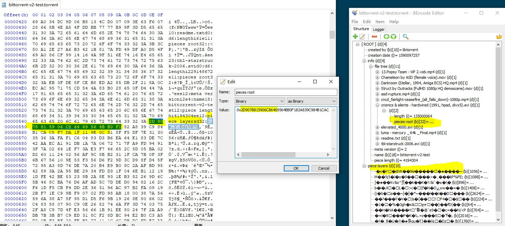

# BitTorrent V2 相关

近日 BitTorrent V2 (以下记作 BTv2/v2, 原版本记作 v1 )协议的种子文件格式被设置为 qBittorrent 最新版本(4.4.0)制作种子的默认格式, 一时间诸多PT鸡飞狗跳, 修定规则以不变应万变(笑)。看了下原始提案, BTv2 确实解决了不少v1的痛点, 但完全抛弃后向兼容性这一点确实值得商榷。本文将主要参考[提案原文](http://bittorrent.org/beps/bep_0052.html)以及著名实现 libtorrent(rasterbar) 给出的[介绍文](https://blog.libtorrent.org/2020/09/bittorrent-v2/)来谈谈 BTv2 带来了什么, 解决了什么问题, 以及引发了哪些新问题。

## BTv1 的痛点

熟悉BT种子文件 (.torrent) 文件的人会知道, 种子文件是一个 Bencode 编码的字典(dictionary, 也可以简单理解为一个 `Map<String,Object> `), 存储了描述待传输文件的必要元信息(根下键为 ”info” 的一个map), 包括文件名路径列表 (files:list), 哈希截取长度 (piece length:integer) 以及 串联的哈希值 (pieces:byteArray)。

在 v1 中饱受诟病的有两点, 一是 files 中每个文件 item 都必须把从文件根目录到最后的文件名各层级逐一列出来, 而非一个简单的树状结构, 这意味着如果一个很深层的目录下有很多文件, 那么这个深层目录树会被重复记录很多次。

第二个是整个哈希机制的设计, 要求根据 files 中给出的文件顺序, 将做种根目录下所有文件连接、抽象成一整个大的二进制文件, 然后以哈希截取长度为步长去计算每一分片的哈希(相关 padding 不多赘述), 最后再将这些二进制的哈希值按顺序连接起来成一个字节数组作为 pieces 的 value。这样的好处当然是实现简单, 但是带来了一些问题, 比如由于制作种子文件的程序有可能未指定 files 里的 item 必须按照字典序排序, 导致同一个做种根目录就算使用同样的 piece length, 但由于文件在 files 中的顺序不同, 导致最终 pieces 里的值不一样, 进一步导致了用相同的一批文件使用不同种子制作程序制作出不同的种子。这一点事实上在 v1 中应该是做了规定必须按照字典序排序, 但由于实现上的缺陷, 部分早期BT客户端未严格排序, 导致后来的客户端普遍做了兼容处理, 未将不按照字典序排序的种子文件视作非法。当然现在回顾来讲在做了兼容处理后这并不是特别严重的问题, 更大的诟病是在这个一整片的哈希机制上。

一整片的哈希导致若某个区块损坏, 需要下载这个整区块。如果步长被设置得很长而实际损坏的部分很短就会造成网络带宽的浪费。整片哈希也不利于单个文件单独校验。相信部分BT老用户一定有这样的经历: 某个区块正好是某几个文件”连结处”, 比如若干个 1KB 小文件后根一个 1GB 大文件, 步长被设置为 1MB, 然而大文件的头一个字节损坏了, 那么校验的时候前几个 1KB 的小文件也会被认为是损坏的。事实上有的种子制作程序会单独为单个文件添加哈希, 但这并不是普遍实现。而像 BitComet 和 qBittorrent 等知名客户端则采用了”傀儡补齐”的方案, 即在小文件后面追加一个全为 0 的 padding 文件凑齐步长, 实际下载的时候并不会下载 padding 文件。这不失为一个很好的 workaround。

以上两个痛点在 v2 中都有了解决方式。

## BTv2 的解法

针对冗余目录结构的问题, 最自然的想法就是利用 Bencode dict 本身的层级结构去复刻文件的层级结构, BTv2 中 `info` 下新增了 `file tree` 节点就是这样组织的, 非常符合直觉, 解决了冗余目录信息的问题。同时为了规范前述字典序等遗留问题, v2 强制规定 `file tree` 中必须按照字典序排序目录结构, 补充规定了一些无效项, 如 Bencode 中的 `-0` 被规定为无效数字, 带前缀0的整数也被规定为无效。

而针对哈希机制, BTv2 首先摒弃了 v1 中采纳的后来被证实容易产生碰撞 (collision) 的 SHA-1 哈希算法, 转向 SHA-256 哈希算法, 得到的哈希长度从 20 字节增加到 32 字节, 另一方面使用哈希树 (Merkle Tree) 的方式组织整个哈希机制, 并且是针对单个文件进行哈希, 而非连接成一个整片。

哈希树, 简单来说即是通过按照一定的步长计算文件(或者任意抽象二进制字节数组)各个分片的哈希, 将这些哈希值当作叶节点, 构造一棵完全二叉树, 父节点的哈希值是函数 `hash(l_child_hash byteArray concat r_child_hash byteArray)` 的值, 最后能够得到一个根节点的哈希值。

*图一 Merkle tree*

BT 中实际网络传输的最小单元大小是 16KB, 所以在对单个文件构造哈希树的步长很自然地被设置成 16KB。除了得到每个文件的根哈希值, 由于传输校验需要, 还需要得到各分片的哈希值, 难道要把以 16KB 为步长的哈希值都记入种子文件吗? 那未免太长。实际上记入种子文件中的是根据原来的 `piece length` 这一项推出的树的倒数某一层的哈希值连接构成的字节数组。比如如果 `piece length` 正好被设置成 16KB, 那就是所有叶子哈希值都要被记入种子文件。如果 `piece length` 被设置为 32KB, 那么树上倒数第二层的所有哈希值构成的字节数组会被记入种子文件。

在前述的 `file tree` 中, 每个实际文件 item 中会有一项 `piece root` , 用以记录这个文件的哈希树根节点哈希值。而在与 info 同级的节点 `piece layer` 中, 以 `dict (Map<byte[],byte[]>)` 的形式记录 (`piece root`, `concated layer piece`) 。这样一来, 相同的文件就会对应相同的根哈希值, 对于需要单个文件校验的情况非常有利, 也无需 padding 的 workaround 。

使用哈希树组织还带来了额外的好处。我们知道磁力链接 (`magnet:?`) 中的哈希实际上是对 `info` 节点的哈希, 客户端根据这个哈希从 DHT 中找到对应的 `peer`, 然后从 `peer` 那里取回整个 `info` 节点。在 v1 中 `info` 节点会存储 `pieces` , 即所有分片的哈希, 在 `info` 节点较大的情况下(种子整体体积大/分片步长设置过小)通过磁力链下载的“起步时间”会相应较慢, 就是卡在从 `peer` 取 `info` 节点这个过程。而 v2 中实际的分片哈希存储在 `piece layer` 节点,  `info` 存的是各文件的根哈希值, 相对较小, 通过磁力链从 `peer` 那里取 `info` 节点的开销也就相应变小了。另一个好处是, 由于现在每一个文件对应一个根哈希值, 文件-根哈希 这个关系实际上也可以被分发到 DHT 上, 即不需要拥有整个种子文件里描述的所有文件也可以支持做种 (seeding), 特别适合同一个文件在不同种子中都出现的情况。可以预见这个特性会一定程度改善公网的保种状况。

然而这些好处、解决的痛点和PT其实没什么关系。

*图二 bittorrent v2 info key as hash*

## BTv2 带来的麻烦

由于有新的节点挂在 `info` 下 (`file tree`, `meta version`), 为了同时兼容 v1 v2, 正确的做法是针对 v1 v2 分别计算info的哈希用于 `magnet` , 在 v2 中 `magnet` 实际上也规定了在 param `xt=urn:btih` 以外的 `xt=urn:btmh` (`i` 表示 `info`, `h` 表示 `hash`, `m` 表示 `multi-info`), 用形如 `magnet:?xt=urn:btih:(v1 hash)&xt=urn:btmh:1220` (v2 hash, 1220 是 magic number) 的形式做后向兼容。计算 v1 哈希时应该跳过 `file tree` 和 `meta version` 节点, 相应的在计算 v2 哈希的时候应跳过 files 节点。

然而根据 v1 的规范相信大多数旧的实现会直接对整个 `info` 节点计算哈希, 这就导致了同时兼容 v1 v2 的 hybrid torrent 文件即使能被旧客户端成功识别, 也会在计算 `magnet` 用的哈希上出现问题, 导致在 DHT/tracker上 无效/错误 的 分发/汇报(announce), 取不到期望的 peer list。同时纯 v2 的 torrent 文件因为缺少 `files` 节点显然不能被旧客户端识别。

更糟糕的是, 上述解决的痛点以及带来的好处对PT来说是不存在的。在讲究私密的传输环境中, 即使相同的文件能在DHT上找到另一处来源, 但由于PT在制种时候设置 `info.private=1`, 合规的客户端对这样的种子必须关闭 DHT 分发, 基本上瓦解了整个新哈希机制带来的好处。同时由于冗余的根哈希值(在 `info` 和 `piece layer` 中各被存了一次), 在目录深度较浅、文件数量较少的情况下(即 `files tree` 带来的种子体积减小优势不足以抵消冗余的根哈希值带来的体积增加), 种子文件甚至是比 v1 还大的, 额外增加了 PT 服务器的存储负担。

基于这些麻烦以及对 PT 带来的无效增益, 很容易理解为什么多数 PT 没有动力去兼容纯 v2 格式的种子文件, 甚至 v1 v2 hybrid 格式的种子文件(体积两倍大)。

## 一些感想

BTv2 从 2008 年提案开始, 到 2017 年才确认种子文件格式, 再到 2020 年 libtorrent 开发团体计划引入, 到 2022 年作为默认种子格式, 前后走过了 14 年, 还有诸多兼容性问题待解决。一方面说明了 BTv1 强大的泛用性、可扩展性(通过 dummy padding 解决一些痛点)以及生命力, 同时也说明了一旦成为 de facto 的东西要改起来时困难是可以预见的。

说到底前述的这些痛点事到如今都某种程度得以解决和克服, 而在以 Netflix 为首的流媒体大行其道、版权要求日趋严格的今天, 贸然撼动一个有着近二十年历史的成熟协议的根基真的是一件好事吗? 最糟糕的情况恐怕是使得协议用户继续甚至加速流失吧。有个网站叫 Torrent Freak, 名字取得挺自嘲倒也符合现实: 今时今日还会有哪些人在用 BT 呢? 国内有网盘, 国外有高清流媒体, 要不是一些非常小众甚至是行走在违法边缘的题材, 相信多数人已经渐渐淡忘 emule、BT 这些工具、协议了。包括像 ftp/smtp 等无数开宗立派的老协议, 现如今他们的改进/套皮实现越来越多、也越来越人性化, 而正主正被越来越多的人遗忘。但他们真的完成历史使命了吗?

想起了”1T 种子”的冷笑话。多年以后如果还有人懂 ”1T种子” 这种笑话的内涵吗? 希望有吧。愿互联网分享精神长存。

## Ref:

Bittorrent V2 BEP: https://www.bittorrent.org/beps/bep_0052.html
BitTorrent v2: https://blog.libtorrent.org/2020/09/bittorrent-v2/
Bittorrent v1 BEP: https://www.bittorrent.org/beps/bep_0003.html
Merkle Tree: https://en.wikipedia.org/wiki/Merkle_tree